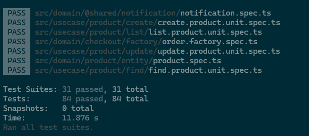

# FC3-CleanArch-ProductAPI

## Description  
This project is part of the **Full Cycle 3.0** course challenge. The objective is to implement the `Product` use case and expose it through a REST API endpoint for listing all products.  

The implementation is written in **TypeScript** and follows **Clean Architecture** principles, ensuring separation of concerns and maintainability.  

Additionally, this repository builds upon a previous challenge that focused on **Domain-Driven Design (DDD)** and **Domain Events**. You can find that challenge [here](https://github.com/LuisGaravaso/FC3-DDD-DomainEvents).  

## Challenge Requirements  
To complete this challenge, the following requirements must be met:  

- Implement the `create`, `find`, `list`, and `update` use cases for the `Product` entity.  
- Develop a REST API with a `/get` endpoint that calls the `list` use case to retrieve all products from the database.  
- Write **unit and integration tests** to validate the correctness of the use cases.  
- Implement **end-to-end (E2E) tests** to ensure API reliability.  
- Ensure that all test cases pass successfully before submission.  
- Maintain a structured codebase following **Clean Architecture** principles.  

## Installation & Setup

###
Cloning the Repository

To get started, clone the repository and navigate to the project directory:
```sh
git clone https://github.com/LuisGaravaso/FC3-CleanArch-ProductAPI.git
cd FC3-CleanArch-ProductAPI
```

### Prerequisites
Ensure you have the following installed on your machine:
- [Node.js](https://nodejs.org/en/download) (latest LTS version recommended)
- [npm](https://www.npmjs.com/) (included with Node.js)

### Install Dependencies
Run the following command to install the required dependencies:
```sh
npm install
```
After downloading the packages the folder `node_modules` should appear.

## Running Tests
To execute all unit tests, use the following command:
```sh
npm test
```
All tests should pass as follows.



## Clean Architecture Concepts
This project follows **Clean Architecture** principles, structured around key concepts:

### Entity
Entities are objects with a distinct identity that persists over time. They encapsulate core business rules and behaviors. Examples in this project include:
- `Customer`
- `Product`

### Repository
Repositories provide an abstraction layer between domain objects and the persistence mechanism. They handle operations such as storing, retrieving, and updating domain entities. Examples include:
- `CustomerRepository`
- `ProductRepository`

### Usecase
Use cases define the application's business logic by orchestrating interactions between entities and repositories. They encapsulate workflows and enforce business rules to ensure consistency and integrity. Examples include:
- `create`, `find`, `list` and `update` for the Customer and Product Repositories

## Project Structure
The project follows a structured **Clean Architecture** approach:
```
/src
│── domain/                # Core business logic, including entities and domain rules
│── infrastructure/        # Handles external integrations such as databases, APIs, and persistence
│   ├── api/               # REST API layer
│   │     ├── __tests__/   # Contains end-to-end tests for Customer and Product endpoints
│   │     ├── routes/      # Defines routes for Customer and Product endpoints
│   │     ├── express.ts   # Configures and initializes the Express application
│   │     ├── server.ts    # Starts the server and handles app lifecycle
│   ├── customer/          # Implementation of the Customer Repository
│   ├── product/           # Implementation of the Product Repository
│   ├── order/             # Implementation of the Order Repository
│── usecase/               # Application-specific business logic (Use Cases)
│   ├── customer/          # Customer use case implementations
│   │     ├── create/      # Handles customer creation, including DTOs and tests
│   │     ├── find/        # Handles customer retrieval by ID, including DTOs and tests
│   │     ├── list/        # Handles listing of customers, including DTOs and tests
│   │     ├── update/      # Handles customer updates, including DTOs and tests
│   ├── product/           # Product use case implementations
│   │     ├── create/      # Handles product creation, including DTOs and tests
│   │     ├── find/        # Handles product retrieval by ID, including DTOs and tests
│   │     ├── list/        # Handles listing of products, including DTOs and tests
│   │     ├── update/      # Handles product updates, including DTOs and tests

```
**NOTE: Only the main folders for this challenge are expanded**

## Database
- This project uses **SQLite** as an in-memory database for testing purposes.
- No additional database setup is required.

## Test Coverage Summary  

### Unit Tests  
Unit tests focus on testing individual components in isolation, ensuring that each function or class behaves as expected. 
They do not interact with external dependencies like databases or APIs.  
- `create.product.unit.spec.ts`  
- `find.product.unit.spec.ts`  
- `list.product.unit.spec.ts`  
- `update.product.unit.spec.ts`  
- `create.customer.unit.spec.ts`  
- `find.customer.unit.spec.ts`  
- `list.customer.unit.spec.ts`  
- `update.customer.unit.spec.ts`  

### Integration Tests  
Integration tests validate interactions between multiple components, such as repositories, services, and databases. 
They ensure that different parts of the system work together correctly.  
- `create.product.integration.spec.ts`  
- `find.product.integration.spec.ts`  
- `list.product.integration.spec.ts`  
- `update.product.integration.spec.ts`  
- `create.customer.integration.spec.ts`  
- `find.customer.integration.spec.ts`  
- `list.customer.integration.spec.ts`  
- `update.customer.integration.spec.ts`  

### End-to-end Tests  
End-to-end (E2E) tests simulate real user scenarios by testing the entire application flow, from request to response, ensuring all components work together as expected in a production-like environment.  
- `customer.e2e.spec.ts`  
- `product.e2e.spec.ts`  

### Other tests
- They were implemented in the previous challenge.
- Information on them [available here](https://github.com/LuisGaravaso/FC3-DDD-DomainEvents) 
